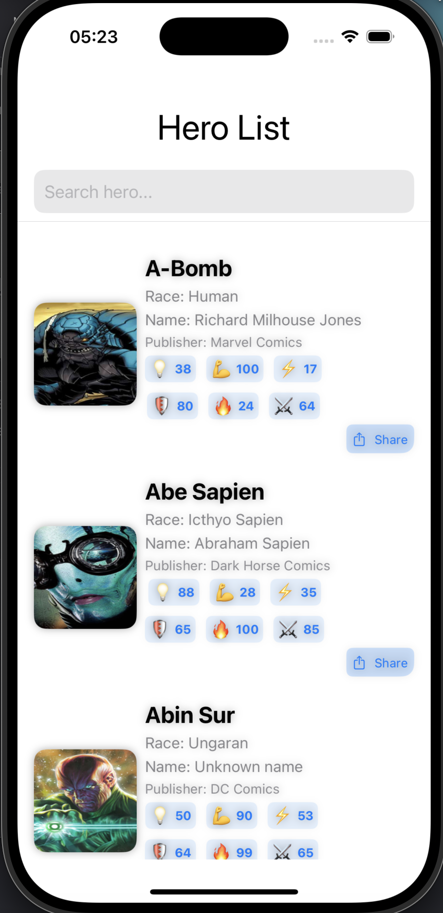
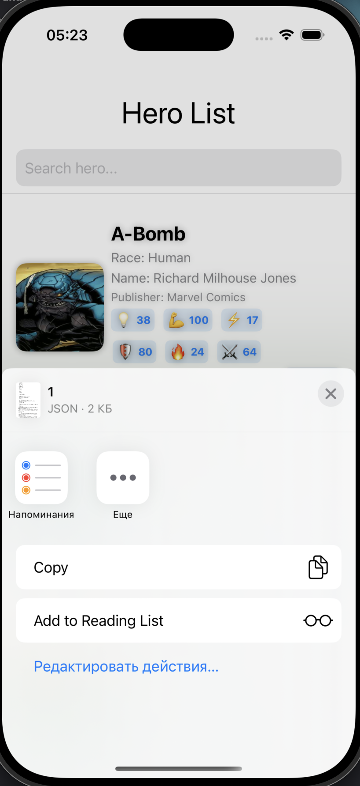
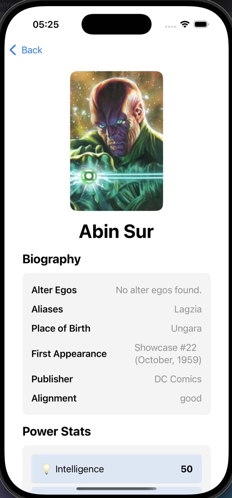
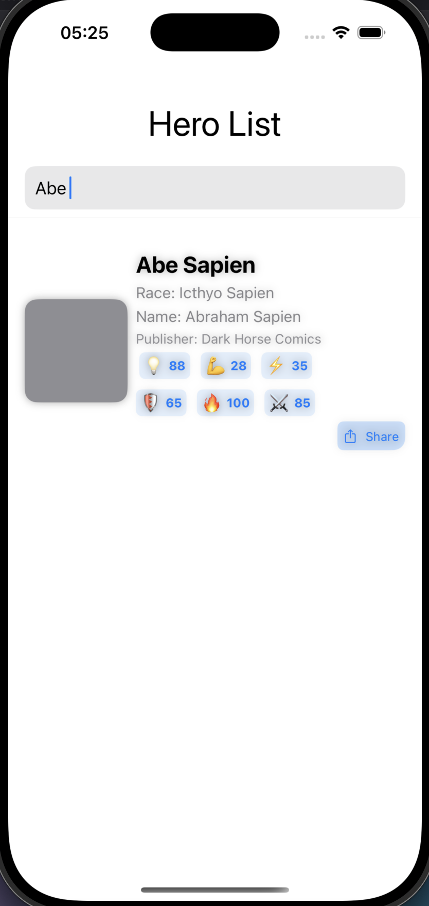

# SuperHero

## Overview
SuperHero is an iOS application built using Swift and SwiftUI that allows users to explore superhero data fetched from the Superhero API. The app is designed with the MVVM architecture and utilizes a router for navigation.

## Features
- **Hero List Display**
  - Displays superhero images, full names, power stats, and biography details.
  - Smooth animations for state transitions.
- **Search Functionality**
  - Allows users to search for heroes by name.
- **Detailed Hero View**
  - Displays complete information about the selected hero.
- **Loading States**
  - Loading indicators for better user experience.
- **Routing & Navigation**
  - Uses `UINavigationController` for routing embedded SwiftUI views.

## Technical Stack
- **Language:** Swift
- **Frameworks:** SwiftUI, UIKit
- **Architecture:** MVVM (Model-View-ViewModel) with Router pattern
- **Networking:** URLSession

## API Integration
- **Endpoints Used:**
  - `/all.json` - Fetches the list of all superheroes.
  - `/id/{id}.json` - Fetches details of a specific superhero.

## Architecture Decisions
- **MVVM Pattern:** Separates concerns by keeping the UI logic in the ViewModel, making the code more modular and testable.
- **Router Pattern:** Manages navigation within the app, ensuring better control over the navigation stack.
- **URLSession for Networking:** Used for API calls, ensuring a lightweight and efficient solution.
- **SwiftUI for UI Components:** Enables modern UI development with reactive data binding.

## Additional Enhancements
- Added a `Share button` to allow users to share superhero details easily.
- Implemented caching mechanisms to improve performance and reduce API calls.

## Demo Video

A short demo video showcasing the app's functionality is available <a href="https://youtube.com/shorts/CjZOXlDfcz0?feature=share">here</a>.

## Screenshots

|  |  |  |  |
|------------------------------------------|------------------------------------------|------------------------------------------|------------------------------------------|

